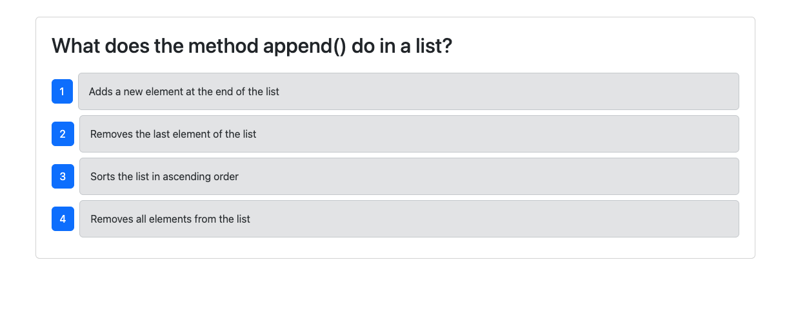

# CICD

## Description
This project was to create a CI/CD Pipeline using the currently working Python Quiz Application and deploy it with GitHub Actions to run the component tests using Cypress when a Pull request is made to the develop branch and have the application deploy when code is merged from develop to main. 

## Screenshot

## Link to Deployed App
https://cicd-ksa5.onrender.com/

## Link to GitHub Repository
https://github.com/melanieprimpas/cicd